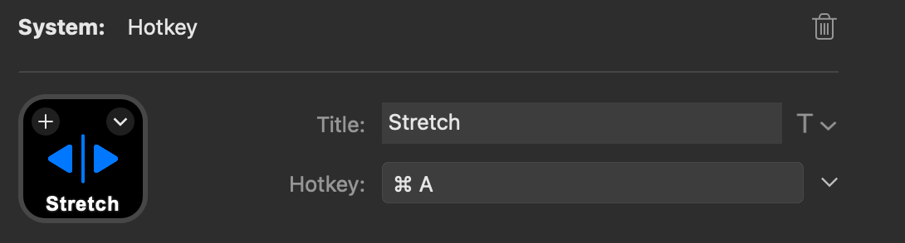
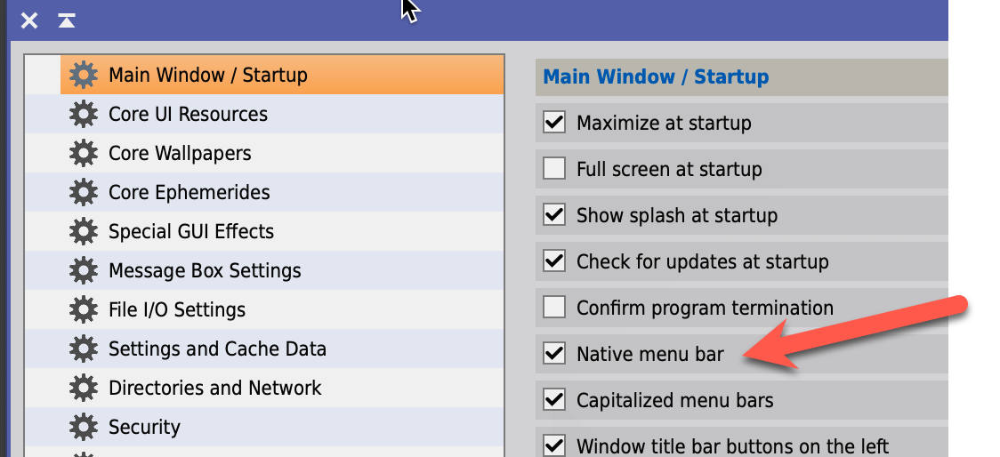
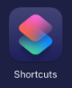
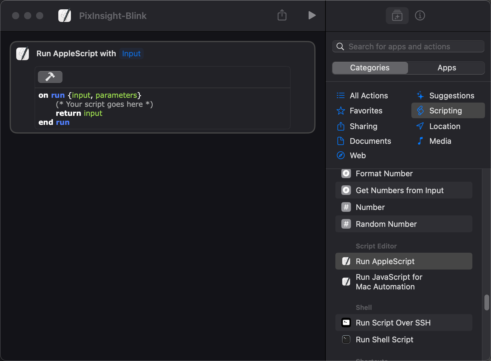
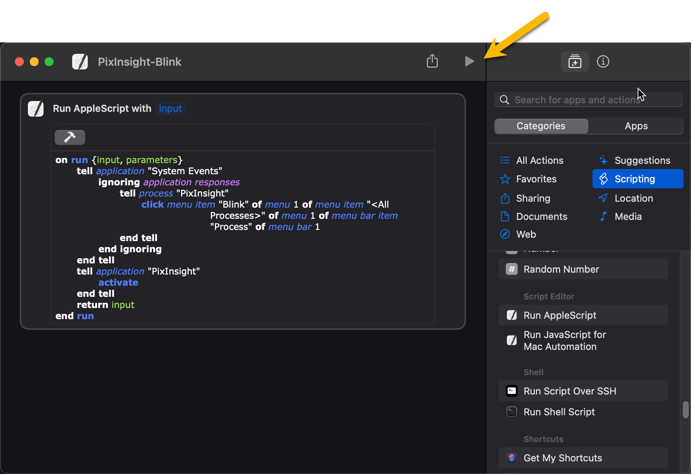

# Controlling PixInsight with a Stream Deck on a Mac

## Keyboard Shortcuts
Using a Stream Deck to send keyboard shortcuts to PixInsight is the simplest, but not everything in PixInsight has a keyboard shortcut.

Setting up a button on a Stream Deck to send keyboard commands can be done using a `Hotkey` item:


Then simply specify the keyboard shortcut, text and icon.
In this example I created a button to do a simple screen stretch:



## Interacting with Menu items
This is the one that had me stumped for a while.

The first thing is that PixInsight should be configured to use the **native** Mac menu system. I believe that's the default, but in case it's not set that way for you, you'll have to go to PixInsight's preferences via the `Edit | Preferences` menu and make sure the `Native menu bar` is checked.



## Interacting with the Process Menu
To do this we'll need to do the following:

1. Create a *Shortcut* that will run an *AppleScript*.
2. Write the *AppleScript* that will click the correct menu item
3. Assign a button on the Stream Deck to run that shortcut.

I had a hard time finding a reliable way to run a Shortcut (or an AppleScript for that matter) from Stream Deck. There are some 3rd party plugins that supposedly can do so, but I could not get any of them to work - I suspect because they have not been updated in a while.

> Come on, Elgato, provide us this functionality natively - LoupeDeck does!!

However, there **is** a way to run an Apple Shortcut (which itself can run an AppleScript) using a `Website` url in Stream Deck. Counterintuitive, but it actually works, no Stream Deck plugins required.

To run a Shortcut, named say `PixInsight-STF`, you can specify this url when creating a `Website` button on the Stream Deck:

```
shortcuts://run-shortcut?name=PixInsight-STF
```

Note that if your shortcut name has a space (or certain other special characters), you will need to **url encode** them.

For example, if your shortcut name has a space in it, you will need to replace spaces with the characters `%20` in your URL

As an example, if your shortcut name is `PixInsight BlurXTerminator, you'll need to specify the URL this way:
```
shortcuts://run-shortcut?name=PixInsight%20BlurXTerminator
```

You can use this web site to URL encode/decode strings if you don't want to do it manually:
[https://www.urlencoder.org/](https://www.urlencoder.org/)

Easiest is to just use Shortcut names that do not contain spaces, and are limited to plain characters, dashes, and underscores. No url encoding needed in that case.

As an example let's setup a button to launch the `Blink` tool in PixInsight. It's located under the `Process` menu, and I'll use the entry for it that is located under the `<All Processes>` sub-menu.

### Step 1 - Create an Apple Shortcut
To do this, launch your `Shortcuts` app:



Create a new shortcut:

- name it `PixInsight-Blink`
- select the `Scripting` option in the right panel, scroll down until you find `Run AppleScript` and double click it



### Step 2 - Specify the AppleScript Code
Now, we have to specify the AppleScript code we want to execute. In this case we want to **"click"** the `Blink` entry in the `<All Processes>` menu under the main `Process` menu.

The following script does this, and sets the focus back to PixInsight (as it loses focus when the shortcut runs).

```AppleScript
on run {input, parameters}
	tell application "System Events"
		ignoring application responses
			tell process "PixInsight"
				click menu item "Blink" of menu 1 of menu item "<All Processes>" of menu 1 of menu bar item "Process" of menu bar 1
			end tell
		end ignoring
	end tell
	tell application "PixInsight"
		activate
	end tell
	return input
end run
```
Replace the entire code block in the script with the one above, and click on the little hammer icon just above it (it will compile and colorize your script, as well as inform you of any issues it has identified).



And that's it, your script has ben created. 

You can now test it by clicking on the `run` icon (the triangle ison) at the top of the shortcut window, as indicated above.

This should open the `Blink` tool, and bring PixInsight to the front.

### Step 3 - Configure Stream Deck Button
Lastly, we have to configure a Stream Deck button to launch this shortcut. To do this we'll use that `Website` trick I mentioned earlier.

Create a button of type `Website`, set the text and icon to whatever you want, and set the URL as follows:
```
shortcuts://run-shortcut?name=PixInsight-Blink
```

That's it, you now have a button on the Stream Deck that will open the `Blink` tool in PixInsight!

## Interacting with Other Menu Items
This works in exactly the same way as with the `Process` menu, but the menu "path" is just slightly different.

For example, to run `WBPP` you would use this AppleScript:

```AppleScript
on run {input, parameters}
	tell application "System Events"
		ignoring application responses
			tell process "PixInsight"
				click menu item "WeightedBatchPreprocessing" of menu 1 of menu item "Batch Processing" of menu 1 of menu bar item "Script" of menu bar 1
			end tell
		end ignoring
	end tell
	tell application "PixInsight"
		activate
	end tell
	return input
end run
```


## Conclusion
You can use this technique to basically run various processes and scripts in PixInsight, you just need to modify that AppleScript to select the particular item you want to click on.
